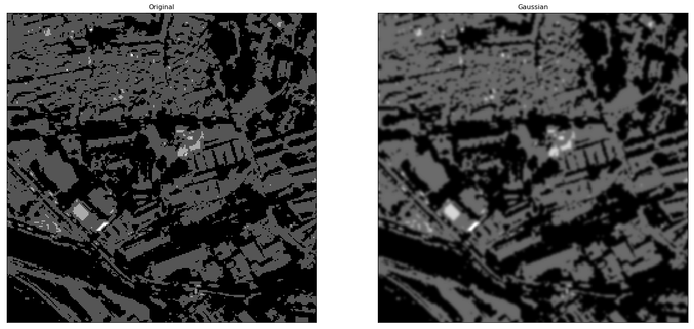
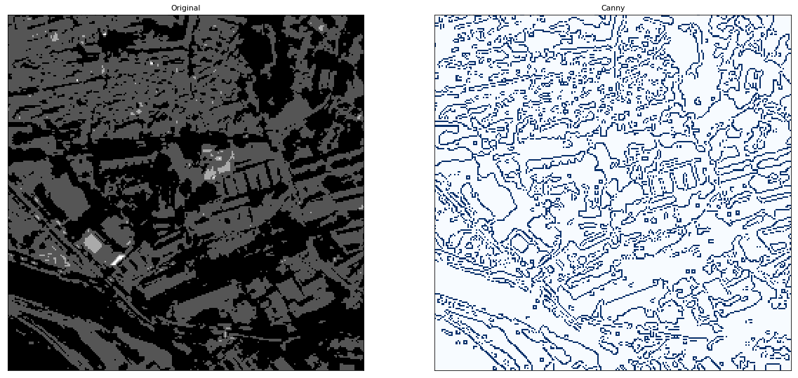
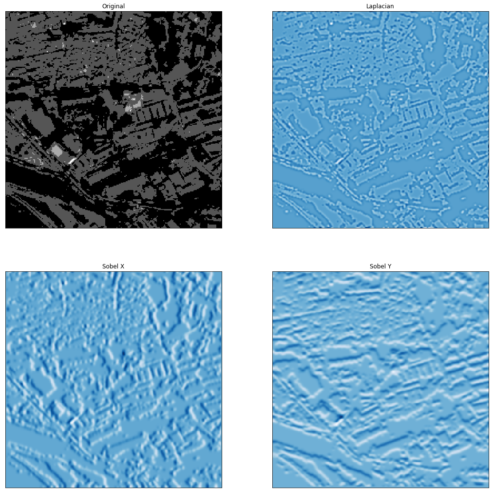
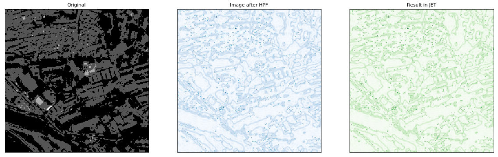
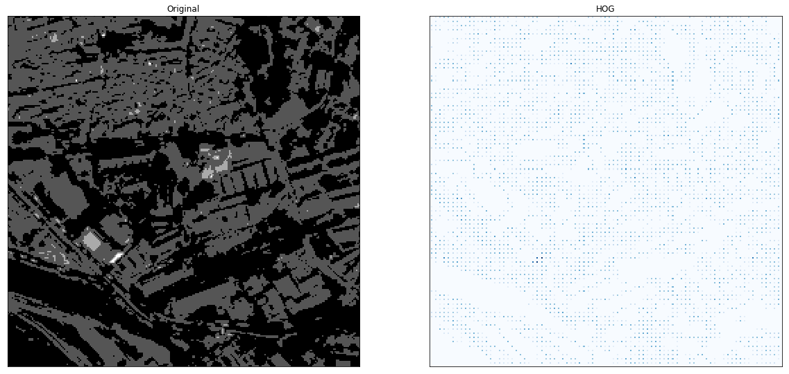
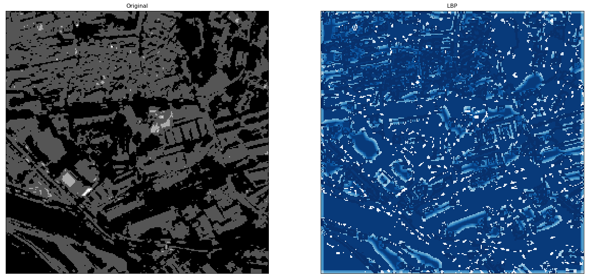
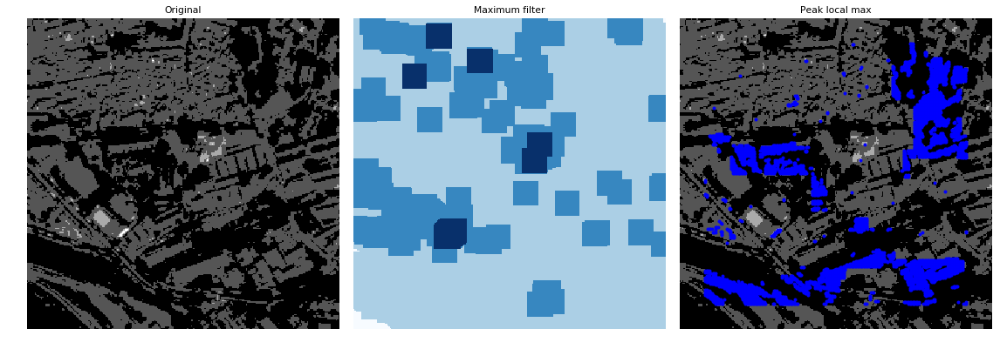
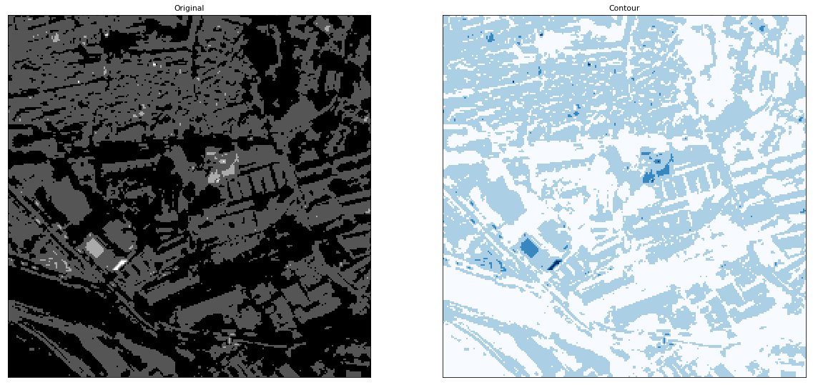

## Satellite image processing and analysis using OpenCV and Sk-Image

The document covers some of the most commonly known image processing and analysis functionalities in attempt to understand how computer vision can help us examine patterns in land cover and land use. 


```python
import gdal
import numpy as np
from osgeo import gdal
import pandas as pd

# For visualization
% matplotlib inline
from matplotlib import pyplot as plt
import cv2
import skimage
from skimage import io
from skimage import external
import rasterio
```

### Panchoromatic Image


```python
img_gray = cv2.imread('high_res_img.tif',0)
```

### Gaussian Filter


```python
plt.subplots(1, 2, figsize=(20,12))

img_a= img_gray[3750:4000, 1750:2000]
img_g = skimage.filters.gaussian(img_a)
plt.subplot(121),plt.imshow(img_a, cmap='gray'), plt.xticks([]), plt.yticks([])
plt.title('Original')
plt.subplot(122),plt.imshow(img_g, cmap='gray'), plt.xticks([]), plt.yticks([])
plt.title('Gaussian')
plt.show()
```





### Canny algorithm


```python
plt.subplots(1, 2, figsize=(20,12))
edges =cv2.Canny(img_a, 0,0.4,0.5)

plt.subplot(121), plt.imshow(img_a, cmap='gray'), plt.xticks([]), plt.yticks([])
plt.title('Original')
plt.subplot(122), plt.imshow(edges, cmap='Blues'), plt.xticks([]), plt.yticks([])
plt.title('Canny')
plt.show()
```





### Sobel X&Y, Laplacian Filters


```python
plt.subplots(2, 2, figsize=(18,18))
laplacian = cv2.Laplacian(img_g, cv2.CV_64F)
sobelx = cv2.Sobel(img_g, cv2.CV_64F, 1,0, ksize=5)
sobely = cv2.Sobel(img_g, cv2.CV_64F, 0,1, ksize=5)

plt.subplot(2,2,1),plt.imshow(img_a,cmap = 'gray')
plt.title('Original'), plt.xticks([]), plt.yticks([])
plt.subplot(2,2,2),plt.imshow(laplacian,cmap = 'Blues')
plt.title('Laplacian'), plt.xticks([]), plt.yticks([])
plt.subplot(2,2,3),plt.imshow(sobelx,cmap = 'Blues')
plt.title('Sobel X'), plt.xticks([]), plt.yticks([])
plt.subplot(2,2,4),plt.imshow(sobely,cmap = 'Blues')
plt.title('Sobel Y'), plt.xticks([]), plt.yticks([])
plt.show()
```





### Fourier Transform

#### With Numpy


```python
plt.subplots(1, 2, figsize=(20,12))
rows, cols = img_a.shape
crow,ccol = rows/2 , cols/2
#fshift[crow-30:crow+30, ccol-30:ccol+30] = 0
fshift[125-30:125+30, 125-30:125+30] = 0
f_ishift = np.fft.ifftshift(fshift)
img_back = np.fft.ifft2(f_ishift)
img_back = np.abs(img_back)

plt.subplot(131),plt.imshow(img_a, cmap = 'gray')
plt.title('Original'), plt.xticks([]), plt.yticks([])
plt.subplot(132),plt.imshow(img_back, cmap = 'Blues')
plt.title('Image after HPF'), plt.xticks([]), plt.yticks([])
plt.subplot(133),plt.imshow(img_back, cmap="Greens")
plt.title('Result in JET'), plt.xticks([]), plt.yticks([])

plt.show()
```





### Histogram of Oriented Gradients (HOG)


```python
plt.subplots(1, 2, figsize=(20,12))

from skimage.feature import hog
d, hog_img = hog(img_a, orientations=3, pixels_per_cell=(3, 3),
                    cells_per_block=(3, 3),block_norm='L1', visualize=True, multichannel=False)
plt.subplot(121),plt.imshow(img_a, cmap='gray')
plt.title('Original'), plt.xticks([]), plt.yticks([])
plt.subplot(122),plt.imshow(hog_img, cmap='Blues')
plt.title('HOG'), plt.xticks([]), plt.yticks([])
plt.show()
```





### Local Binary Patterns(LBP)


```python
plt.subplots(1, 2, figsize=(20,12))
from skimage.feature import local_binary_pattern

radius = 3
n_points = 8 * radius
METHOD = 'uniform'
plt.rcParams['font.size'] = 9

lbp_img = local_binary_pattern(img_a, n_points, radius, METHOD)

plt.subplot(121),plt.imshow(img_a, cmap='gray')
plt.title('Original'), plt.xticks([]), plt.yticks([])
plt.subplot(122),plt.imshow(lbp_img, cmap='Blues')


plt.title('LBP'), plt.xticks([]), plt.yticks([])
plt.show()
```





### Local Maxima


```python

from scipy import ndimage as ndi
from skimage.feature import peak_local_max
from skimage import data, img_as_float

image_max = ndi.maximum_filter(img_a, size=20, mode='constant')
coordinates = peak_local_max(img_a, min_distance=20)

fig, axes = plt.subplots(1, 3, figsize=(16, 12), sharex=True, sharey=True)
ax = axes.ravel()
ax[0].imshow(img_a, cmap=plt.cm.gray)
ax[0].axis('off')
ax[0].set_title('Original')

ax[1].imshow(image_max, cmap=plt.cm.Blues)
ax[1].axis('off')
ax[1].set_title('Maximum filter')

ax[2].imshow(img_a, cmap=plt.cm.gray)
ax[2].autoscale(False)
ax[2].plot(coordinates[:, 1], coordinates[:, 0], 'b.')
ax[2].axis('off')
ax[2].set_title('Peak local max')

fig.tight_layout()

plt.show()
```





### Contours


```python
plt.subplots(1, 2, figsize=(20,12))

ret,thresh = cv2.threshold(img_a, 127,255,0)
image, contours, hierarchy = cv2.findContours(thresh,cv2.RETR_TREE,cv2.CHAIN_APPROX_SIMPLE)
cntr_img = cv2.drawContours(img_a, contours, -1, (0,255,0), 3)

plt.subplot(121),plt.imshow(img_a, cmap='gray')
plt.title('Original'), plt.xticks([]), plt.yticks([])
plt.subplot(122),plt.imshow(cntr_img, cmap='Blues')
plt.title('Contour'), plt.xticks([]), plt.yticks([])

plt.show()
```




